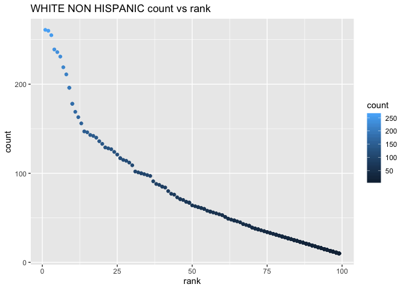

p8105\_hw2\_ys3298
================
Yimeng SHANG
9/26/2019

# PROBLEM1

``` r
library(tidyverse)
```

    ## ── Attaching packages ───────────────────────────────────────────────────────────── tidyverse 1.2.1 ──

    ## ✔ ggplot2 3.2.1     ✔ purrr   0.3.2
    ## ✔ tibble  2.1.3     ✔ dplyr   0.8.3
    ## ✔ tidyr   1.0.0     ✔ stringr 1.4.0
    ## ✔ readr   1.3.1     ✔ forcats 0.4.0

    ## ── Conflicts ──────────────────────────────────────────────────────────────── tidyverse_conflicts() ──
    ## ✖ dplyr::filter() masks stats::filter()
    ## ✖ dplyr::lag()    masks stats::lag()

``` r
library(readxl)

trash_wheel = read_excel("../data/Trash-Wheel-Collection-Totals-8-6-19.xlsx", sheet = 1, range = "A2:N408") %>%
  janitor::clean_names() %>%
  filter(dumpster != "NA") %>%
  mutate(sports_balls = as.integer(sports_balls))
typeof(trash_wheel$sports_balls) 
```

    ## [1] "integer"

``` r
# remove NA from dumpster-specific data
precipi2018 = read_excel("../data/Trash-Wheel-Collection-Totals-8-6-19.xlsx", sheet = 5, skip = 1) %>%
  janitor::clean_names() %>%
  filter(total != "NA") %>%
  filter(month != "NA") %>%
  mutate(year = "2018")

precipi2017 = read_excel("../data/Trash-Wheel-Collection-Totals-8-6-19.xlsx", sheet = 6, skip = 1) %>%
  janitor::clean_names() %>%
  filter(total != "NA") %>%
  filter(month != "NA") %>%
  mutate(year = "2017")

# combine precipitation datasets 
# convert month to a character variable
precipi = bind_rows(precipi2017, precipi2018) %>%
  select(year, month, total) %>%
  mutate(month = month.name[month])

precipi
```

    ## # A tibble: 24 x 3
    ##    year  month     total
    ##    <chr> <chr>     <dbl>
    ##  1 2017  January    2.34
    ##  2 2017  February   1.46
    ##  3 2017  March      3.57
    ##  4 2017  April      3.99
    ##  5 2017  May        5.64
    ##  6 2017  June       1.4 
    ##  7 2017  July       7.09
    ##  8 2017  August     4.44
    ##  9 2017  September  1.95
    ## 10 2017  October    0   
    ## # … with 14 more rows

From the data, we can notice that the total precipitations for 2014-2018
are 51.59, 43.21, 39.95, 32.93 and 70.33 respectively, which decrease
year by year. For trash\_wheel dataset, there are 344 observations and
14 variables. Key Variables from this dataset include “dumpster”,
“year”, “month”, “date”, numbers of “plastic bottles”, “glass
bottles” etc. For precipitation dataset, there are 24
observations(excluding the total number for whole year in 2017 and
2018.) and 14 variables. Key Variables include year, month and total
number of precipitation in each month in 2017 and 2018.

The total precipitation in 2018 is 70.33 inches. The median numbers of
sports balls in a dumpster in 2014-2018 are 6, 16, 26, 8, 4. The mean
numbers of plastic bottle in a dumpster in 2014-2018 are 1540, 1960,
2980, 2260, 1200. The mean numbers of grocery bags in 2014-2018 are 880,
1392, 2292, 1939, 752. From these data, we can easily noticed that the
number of sports balls, plastic bottle and grocery bags firstly
increased and then decrease from 2014 to 2018.

# PROBLEM2

``` r
# clean the data in pols and snp 
pols = read_csv("../data/pols-month.csv") %>%
  janitor::clean_names() %>%
  separate(mon, into = c("year", "month", "day"), convert = TRUE) %>%
  mutate(month = month.abb[as.factor(month)],
         president = factor(prez_gop, labels = c("dem", "gop", "gop"))) %>%   ##take"2" also as "gop"
  select(-prez_dem, -prez_gop, -day)
```

    ## Parsed with column specification:
    ## cols(
    ##   mon = col_date(format = ""),
    ##   prez_gop = col_double(),
    ##   gov_gop = col_double(),
    ##   sen_gop = col_double(),
    ##   rep_gop = col_double(),
    ##   prez_dem = col_double(),
    ##   gov_dem = col_double(),
    ##   sen_dem = col_double(),
    ##   rep_dem = col_double()
    ## )

``` r
snp = read_csv("../data/snp.csv") %>%
  janitor::clean_names() %>%
  separate(date, into = c("month", "day", "year"), convert = TRUE) %>%
  arrange(year, month) %>%
  mutate(month = month.abb[as.factor(month)]) %>%
  select(year, month, close, -day)
```

    ## Parsed with column specification:
    ## cols(
    ##   date = col_character(),
    ##   close = col_double()
    ## )

``` r
# tidy the unemployment data 
tidy_unemploy = read_csv("../data/unemployment.csv") %>%
  pivot_longer(
    Jan:Dec,
    names_to = "month",
    values_to = "unemployment") %>%
  select(year = Year, everything()) %>%
  mutate( year = as.integer(year))
```

    ## Parsed with column specification:
    ## cols(
    ##   Year = col_double(),
    ##   Jan = col_double(),
    ##   Feb = col_double(),
    ##   Mar = col_double(),
    ##   Apr = col_double(),
    ##   May = col_double(),
    ##   Jun = col_double(),
    ##   Jul = col_double(),
    ##   Aug = col_double(),
    ##   Sep = col_double(),
    ##   Oct = col_double(),
    ##   Nov = col_double(),
    ##   Dec = col_double()
    ## )

``` r
# Join the datasets 
snp_pols = left_join(pols, snp, by = c("year", "month"))
snp_pols_unemploy = left_join(snp_pols, tidy_unemploy, by = c("year", "month"))

snp_pols_unemploy
```

    ## # A tibble: 822 x 11
    ##     year month gov_gop sen_gop rep_gop gov_dem sen_dem rep_dem president
    ##    <int> <chr>   <dbl>   <dbl>   <dbl>   <dbl>   <dbl>   <dbl> <fct>    
    ##  1  1947 Jan        23      51     253      23      45     198 dem      
    ##  2  1947 Feb        23      51     253      23      45     198 dem      
    ##  3  1947 Mar        23      51     253      23      45     198 dem      
    ##  4  1947 Apr        23      51     253      23      45     198 dem      
    ##  5  1947 May        23      51     253      23      45     198 dem      
    ##  6  1947 Jun        23      51     253      23      45     198 dem      
    ##  7  1947 Jul        23      51     253      23      45     198 dem      
    ##  8  1947 Aug        23      51     253      23      45     198 dem      
    ##  9  1947 Sep        23      51     253      23      45     198 dem      
    ## 10  1947 Oct        23      51     253      23      45     198 dem      
    ## # … with 812 more rows, and 2 more variables: close <dbl>,
    ## #   unemployment <dbl>

In the pols\_month dataset, there are 9 variables and 822 observations
related to the number of national politicians who are democratic or
republican at any given time. **prez** means president, **gov** means
governors, **sen** means senators, **rep** means representatives and
**gop** means republican, **dem** means democratic. File “snp” contains
3 variables and 787 observations related to Standard & Poor’s stock
market index (S\&P), often used as a representative measure of stock
market as a whole. “Unemployment” shows percentage of unemployment in
each month of the associated year, containing 3 variables and 816
observations. After we merge snp, pols and unemploy, we get a (822, 11)
dataset. We can clearly see what party the president is, how many
governors in each party, how many unemployment and what’s the Standard &
Poor’s stock market index in each month from 1947 to 2015. Key variables
include \[year\], \[month\], \[unemployment\], \[president\] etc.

# PROBLEM3

``` r
# unify the types
names = read_csv("../data/Popular_Baby_Names.csv") %>%
  janitor::clean_names() %>%
  mutate(
    childs_first_name = str_to_upper(childs_first_name)) 
```

    ## Parsed with column specification:
    ## cols(
    ##   `Year of Birth` = col_double(),
    ##   Gender = col_character(),
    ##   Ethnicity = col_character(),
    ##   `Child's First Name` = col_character(),
    ##   Count = col_double(),
    ##   Rank = col_double()
    ## )

``` r
names$ethnicity[pull(names, ethnicity) == "ASIAN AND PACI"] = "ASIAN AND PACIFIC ISLANDER"
names$ethnicity[pull(names, ethnicity) == "BLACK NON HISP"] = "BLACK NON HISPANIC"
names$ethnicity[pull(names, ethnicity) == "WHITE NON HISP"] = "WHITE NON HISPANIC"

names = distinct(names)
# unique(names)

dim(names)
```

    ## [1] 12181     6

``` r
names
```

    ## # A tibble: 12,181 x 6
    ##    year_of_birth gender ethnicity              childs_first_na… count  rank
    ##            <dbl> <chr>  <chr>                  <chr>            <dbl> <dbl>
    ##  1          2016 FEMALE ASIAN AND PACIFIC ISL… OLIVIA             172     1
    ##  2          2016 FEMALE ASIAN AND PACIFIC ISL… CHLOE              112     2
    ##  3          2016 FEMALE ASIAN AND PACIFIC ISL… SOPHIA             104     3
    ##  4          2016 FEMALE ASIAN AND PACIFIC ISL… EMILY               99     4
    ##  5          2016 FEMALE ASIAN AND PACIFIC ISL… EMMA                99     4
    ##  6          2016 FEMALE ASIAN AND PACIFIC ISL… MIA                 79     5
    ##  7          2016 FEMALE ASIAN AND PACIFIC ISL… CHARLOTTE           59     6
    ##  8          2016 FEMALE ASIAN AND PACIFIC ISL… SARAH               57     7
    ##  9          2016 FEMALE ASIAN AND PACIFIC ISL… ISABELLA            56     8
    ## 10          2016 FEMALE ASIAN AND PACIFIC ISL… HANNAH              56     8
    ## # … with 12,171 more rows

``` r
# showing the rank in popularity of the name “Olivia” 
olivia = subset(names, pull(names, childs_first_name) == "OLIVIA") %>%
  select(year_of_birth, ethnicity, rank) %>%
  pivot_wider(
    names_from = ethnicity,
    values_from = rank) %>%
    arrange(year_of_birth)
olivia 
```

    ## # A tibble: 6 x 5
    ##   year_of_birth `ASIAN AND PACI… `BLACK NON HISP… HISPANIC `WHITE NON HISP…
    ##           <dbl>            <dbl>            <dbl>    <dbl>            <dbl>
    ## 1          2011                4               10       18                2
    ## 2          2012                3                8       22                4
    ## 3          2013                3                6       22                1
    ## 4          2014                1                8       16                1
    ## 5          2015                1                4       16                1
    ## 6          2016                1                8       13                1

``` r
# showing the most popular name among male children 
popular_male = filter(names, gender == "MALE") %>%
  select(-gender, -count) %>%
  filter(rank == "1") %>%
  select(-rank) %>%
  pivot_wider(
    names_from = ethnicity,
    values_from = childs_first_name) %>%
  arrange(year_of_birth)

popular_male
```

    ## # A tibble: 6 x 5
    ##   year_of_birth `ASIAN AND PACI… `BLACK NON HISP… HISPANIC `WHITE NON HISP…
    ##           <dbl> <chr>            <chr>            <chr>    <chr>           
    ## 1          2011 ETHAN            JAYDEN           JAYDEN   MICHAEL         
    ## 2          2012 RYAN             JAYDEN           JAYDEN   JOSEPH          
    ## 3          2013 JAYDEN           ETHAN            JAYDEN   DAVID           
    ## 4          2014 JAYDEN           ETHAN            LIAM     JOSEPH          
    ## 5          2015 JAYDEN           NOAH             LIAM     DAVID           
    ## 6          2016 ETHAN            NOAH             LIAM     JOSEPH

``` r
# a scatter plot showing the number of children with a name (y axis) against the rank in popularity of that name (x axis)
male = filter(names, gender == "MALE") %>%
  filter(year_of_birth == "2016") %>%
  filter(ethnicity == "WHITE NON HISPANIC")

ggplot(male, aes(x = rank, y = count, color = count)) + geom_point() + ggtitle("WHITE NON HISPANIC count vs rank")
```

<!-- -->
